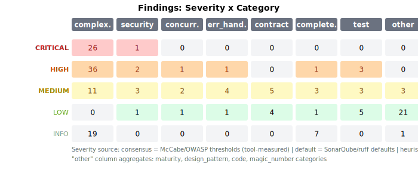
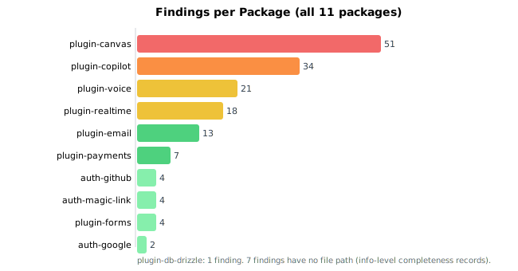

# Code Review Report -- theokit-plugins

**Date:** 2026-06-11
**Reviewer:** loop-code-review v0.3.0 (automated)
**Target:** theokit-plugins monorepo (11 packages, 11,141 source LOC, 98 source files)
**Mode:** full (5 phases: baseline, completeness, code review + complexity + maturity + patterns, test audit, report)
**Branch:** develop

---

## 1. Executive Summary

The theokit-plugins monorepo is a well-structured TypeScript plugin collection with consistent architecture and strong pattern awareness across its 11 packages. The review inspected 182 files (100% coverage) and identified **166 findings**: 27 critical, 44 high, 34 medium, 34 low, and 27 info. The critical mass of findings concentrates in two areas: (1) extreme cyclomatic complexity -- 26 functions exceed CC=25 with the worst at CC=158, making them untestable by McCabe standards; and (2) a cluster of security issues centered on regex-based SVG/HTML sanitization and SQL identifier injection. The top 3 risks are: **SQL injection in plugin-canvas SQLite store** (the only critical security finding), **SVG sanitizer XSS bypass via regex evasion** (high security), and **race condition in CopilotRuntime enabling budget bypass** (high concurrency). Of the 166 findings, **23 are blocking** (must-fix before merge) and 143 are non-blocking suggestions.

---

## 2. Severity Matrix



| Severity | complexity | security | concurrency | error_handling | contract | completeness | test | other | **Total** |
|----------|-----------|----------|-------------|---------------|----------|-------------|------|-------|-----------|
| **Critical** | 26 | 1 | 0 | 0 | 0 | 0 | 0 | 0 | **27** |
| **High** | 36 | 2 | 1 | 1 | 0 | 1 | 3 | 0 | **44** |
| **Medium** | 11 | 3 | 2 | 4 | 5 | 3 | 3 | 3 | **34** |
| **Low** | 0 | 1 | 1 | 1 | 4 | 1 | 5 | 21 | **34** |
| **Info** | 19 | 0 | 0 | 0 | 0 | 7 | 0 | 1 | **27** |
| **Total** | **92** | **7** | **4** | **6** | **9** | **12** | **11** | **25** | **166** |

"other" aggregates: maturity (20), design_pattern (2), code (1), magic_number (2).

---

## 3. Findings per Package



| Package | Source LOC | Findings | Critical | High | Blocking |
|---------|-----------|----------|----------|------|----------|
| plugin-canvas | 3,245 | 51 | 10 | 12 | 7 |
| plugin-copilot | 1,723 | 34 | 3 | 8 | 5 |
| plugin-voice | 1,702 | 21 | 5 | 5 | 0 |
| plugin-realtime | 1,669 | 18 | 3 | 2 | 2 |
| plugin-email | 522 | 13 | 0 | 5 | 1 |
| plugin-payments | 639 | 7 | 1 | 2 | 0 |
| auth-github | 256 | 4 | 1 | 1 | 0 |
| auth-magic-link | 315 | 4 | 1 | 1 | 0 |
| plugin-forms | 530 | 4 | 0 | 2 | 1 |
| auth-google | 220 | 2 | 2 | 0 | 0 |
| plugin-db-drizzle | 320 | 1 | 0 | 0 | 1 |

---

## 4. Blocking Findings (must-fix)

### 4a. Consensus Tier (non-negotiable)

These findings are sourced from OWASP/McCabe consensus thresholds or tool-verified measurements. They represent security vulnerabilities or race conditions with concrete exploit paths.

| # | ID | Title | File:Line | Category | Severity |
|---|---|---|---|---|---|
| 1 | 108 | SQL injection via unescaped table name interpolation in SQLite store | `plugin-canvas/src/store.ts:197` | security | critical |
| 2 | 129 | SVG sanitizer regex bypass: on-event attributes can evade ON_ATTR_RE via newlines | `plugin-canvas/src/ui/renderers/sanitize.ts:25` | security | high |
| 3 | 132 | Race condition in CopilotRuntime.handleFrame: concurrent triggers fire without serialization | `plugin-copilot/src/internal/runtime.ts:178` | concurrency | high |
| 4 | 133 | Swallowed onAfterInsert error in route-handlers.ts silences side-effect failures | `plugin-canvas/src/route-handlers.ts:128` | error_handling | high |
| 5 | 134 | Stripe API key potentially exposed in copilot agent config serialized to wire | `plugin-copilot/src/internal/runtime.ts:228` | security | high |
| 6 | 130 | Race condition in mermaid lazy loader: concurrent loadMermaid calls may initialize twice | `plugin-canvas/src/ui/renderers/mermaid-artifact.tsx:14` | concurrency | medium |
| 7 | 131 | Race condition in Yjs lazy loader: concurrent loadYjs calls may import twice | `plugin-realtime/src/yjs-provider.ts:69` | concurrency | medium |
| 8 | 135 | BudgetBridge month reset uses fixed 30-day window instead of calendar months | `plugin-copilot/src/internal/budget-bridge.ts:54` | contract | medium |
| 9 | 136 | CopilotRuntime.deactivate sets unsubscribe fields to typed undefined, not actual undefined | `plugin-copilot/src/internal/runtime.ts:155` | contract | medium |
| 10 | 137 | Listener errors silently swallowed in MemoryRealtimeProvider and YjsRealtimeProvider fanout | `plugin-realtime/src/memory-provider.ts:54` | error_handling | medium |
| 11 | 138 | Unchecked type assertion casts arbitrary string to ArtifactKind | `plugin-canvas/src/route-handlers.ts:70` | contract | medium |
| 12 | 139 | ResendProvider.send swallows partial error context from Resend API | `plugin-email/src/resend-provider.ts:79` | error_handling | medium |
| 13 | 140 | enforceArtifactSecurity SVG check misses on-event handlers and data: URI vectors | `plugin-canvas/src/schema.ts:264` | security | medium |
| 14 | 142 | CopilotRuntime.runAgent swallows agent errors: catch broadcasts but does not propagate | `plugin-copilot/src/internal/runtime.ts:248` | error_handling | medium |
| 15 | 144 | CopilotProvider usage prop called on every render without dep tracking | `plugin-copilot/src/react/copilot-provider.tsx:92` | contract | medium |
| 16 | 146 | Internal error messages leaked to HTTP clients in errorToResponse | `plugin-canvas/src/route-handlers.ts:183` | security | medium |
| 17 | 147 | WebhookRegistry dispatch runs handlers sequentially, returns on first failure | `plugin-payments/src/webhook.ts:88` | error_handling | medium |
| 18 | 150 | Devtools tab mounts iframe to localhost without sandbox attribute | `plugin-db-drizzle/src/devtools.ts:42` | security | medium |
| 19 | 155 | TheoForm handleValid swallows non-ActionInputError exceptions silently | `plugin-forms/src/components/TheoForm.tsx:104` | contract | medium |

### 4b. Default Tier (test coverage gaps that block security verification)

| # | ID | Title | File | Category | Severity |
|---|---|---|---|---|---|
| 20 | 2 | plugin-voice README claims automatic endpoint registration; implementation is a no-op | `plugin-voice/src/index.ts:1062` | completeness | high |
| 21 | 156 | SQLite adapter has zero test coverage -- table name SQL injection untested | `plugin-canvas/tests/store.test.ts` | test | high |
| 22 | 157 | SVG sanitizer missing tests for known regex bypass vectors | `plugin-canvas/tests/sanitize.test.ts` | test | high |
| 23 | 159 | No test verifies API keys are not leaked in copilot broadcast payloads | `plugin-copilot/tests/runtime.test.ts` | test | high |

---

## 5. Non-blocking Findings (nits)

### 5a. Complexity (tool-measured, consensus thresholds)

73 complexity findings were measured by lizard (cyclomatic complexity analyzer). All use McCabe 1976 NIST thresholds -- these are tool-measured, not heuristic. None are marked blocking because complexity alone does not prevent a merge, but functions above CC=25 are classified as "untestable" per McCabe.

**Top 10 worst offenders:**

| # | Function | File:Line | CC | Classification |
|---|---|---|---|---|
| 1 | `reducer` | `plugin-canvas/src/ui/use-canvas.ts:53` | 158 | untestable |
| 2 | `CanvasPanel` | `plugin-canvas/src/ui/canvas-panel.tsx:63` | 115 | untestable |
| 3 | `createSqliteArtifactStore` | `plugin-canvas/src/store.ts:178` | 97 | untestable |
| 4 | `CopilotChat` | `plugin-copilot/src/react/CopilotChat.tsx:47` | 70 | untestable |
| 5 | `defineCopilot` | `plugin-copilot/src/define-copilot.ts:74` | 63 | untestable |
| 6 | `handleFrame` | `plugin-copilot/src/react/copilot-provider.tsx:125` | 60 | untestable |
| 7 | `(anonymous useEffect)` | `plugin-realtime/src/react/index.ts:119` | 60 | untestable |
| 8 | `handleSttRequest` | `plugin-voice/src/stt-server.ts:67` | 57 | untestable |
| 9 | `google` | `auth-google/src/index.ts:57` | 56 | untestable |
| 10 | `github` | `auth-github/src/index.ts:59` | 51 | untestable |

Full complexity breakdown: 26 critical (CC>25), 36 high (CC 16-25), 11 medium (CC 11-15). Additionally, 4 functions have large parameter lists (>5 params) and 15 files exceed 200 LOC.

### 5b. Maturity (heuristic)

20 maturity findings, all non-blocking. Three elevated to medium severity due to cross-package structural duplication:

- **[Nit:]** Base error class pattern duplicated between `plugin-copilot/src/types.ts:200` and `plugin-realtime/src/types.ts:193` -- extract a shared `PluginError` base (finding #115).
- **[Nit:]** OAuth token exchange duplicated between `auth-github/src/index.ts:100` and `auth-google/src/index.ts:111` -- extract shared `exchangeAuthorizationCode()` (finding #116).
- **[Nit:]** `tsup.config.ts` near-identical across 7 packages -- extract a shared preset (finding #118).

Remaining 17 findings are low/info: 6 vague variable names (`output`, `obj`, `result`, `f`, `n`), 4 duplicate blocks within packages, 3 magic literals, 1 verbose boolean, 1 silent catch, 1 what-comment, 1 dead code interface.

### 5c. Design Patterns (heuristic)

3 findings, all non-blocking:

- **[Nit:]** `defineEmailProvider` is an identity function with no validation -- misapplied factory pattern (finding #105).
- **[Nit:]** `enforceArtifactSecurity` kind-keyed if-chain is an OCP signal -- Strategy candidate as kinds grow (finding #106).
- **[Nit:]** `ensureVoicePeer` / `ensureCanvasPeer` are structurally identical -- DRY opportunity (finding #107).

### 5d. Other Low/Medium Non-blocking

| ID | Title | File | Category |
|---|---|---|---|
| 1 | [Nit:] `useYDoc` always throws (stub exported) | `plugin-realtime/src/react/index.ts:293` | completeness |
| 3 | [Nit:] plugin-voice README status line says 0.1.0 scaffold-only | `plugin-voice/src/index.ts:4` | completeness |
| 5 | [Nit:] `useBroadcast()` and `updateMyPresence()` are local-only | `plugin-realtime/src/react/index.ts:201` | completeness |
| 141 | [Nit:] `useCopilotReadable` re-broadcasts on every render for objects | `plugin-copilot/src/react/hooks.ts:61` | contract |
| 145 | [Nit:] CopilotProvider message cap slicing incorrect behavior | `plugin-copilot/src/react/copilot-provider.tsx:179` | contract |
| 148 | [Nit:] `defineEmailProvider` is a no-op pass-through | `plugin-email/src/provider.ts:26` | contract |
| 151 | [Nit:] TriggerEvaluator `scheduleIdleCheck` replaces timer without awaiting | `plugin-copilot/src/internal/trigger-evaluator.ts:95` | concurrency |
| 152 | [Nit:] `formatAmountForStripe` uses Intl heuristic for zero-decimal detection | `plugin-payments/src/currency.ts:16` | contract |
| 153 | [Nit:] `useTts` cleanupAudio swallows error without logging | `plugin-voice/src/ui/use-tts.ts:100` | error_handling |
| 154 | [Nit:] `escapeAttr` does not escape single quotes | `plugin-email/src/magic-link.ts:169` | security |
| 158 | [Nit:] No concurrency test for simultaneous message handling | `plugin-copilot/tests/runtime.test.ts` | test |
| 160 | [Nit:] 14 tests use setTimeout-based polling -- flakiness risk | `plugin-copilot/tests/runtime.test.ts` | test |
| 161 | [Nit:] plugin-email resend-provider.ts has zero test coverage | `plugin-email/src/resend-provider.ts` | test |
| 162-166 | [Nit:] Various test coverage gaps (React components, renderers, forms, webhooks, store) | various | test |

---

## 6. Complexity Hotspots

The complexity findings are the dominant category (92 of 166 findings, 55%). The distribution is not uniform -- it concentrates in three packages:

| Package | Critical CC | High CC | Medium CC | Worst Function |
|---------|------------|---------|-----------|----------------|
| plugin-canvas | 10 | 7 | 5 | `reducer` CC=158 |
| plugin-copilot | 3 | 6 | 2 | `CopilotChat` CC=70 |
| plugin-voice | 5 | 3 | 1 | `handleSttRequest` CC=57 |
| plugin-realtime | 3 | 1 | 3 | `(anonymous useEffect)` CC=60 |
| plugin-email | 0 | 5 | 0 | `send` CC=21 |
| auth-google | 2 | 0 | 0 | `google` CC=56 |
| auth-github | 1 | 0 | 0 | `github` CC=51 |
| auth-magic-link | 1 | 1 | 0 | `defaultResolveEmail` CC=27 |
| plugin-payments | 1 | 2 | 0 | `processWebhook` CC=33 |
| plugin-forms | 0 | 2 | 0 | `useTheoField` CC=23 |

**Root cause pattern:** Most high-CC functions are React components or factory functions that inline configuration, validation, event handling, and rendering into a single function body. The `reducer` in `use-canvas.ts` (CC=158) handles all canvas action types in a single switch/case. The auth providers (`google` CC=56, `github` CC=51) inline OAuth flow setup, callback handling, and session management in one factory.

**Confidence:** These CC values are tool-measured by lizard, not heuristic estimates.

---

## 7. Test Coverage Analysis

### Pyramid Summary

| Layer | Count | Assessment |
|-------|-------|------------|
| Unit tests | ~470 test cases (50 files) | Strong base |
| Integration tests | 6 test files | Moderate |
| E2E tests | 0 | Acceptable for a plugin library |

### Test-to-Source Ratio by Package

| Package | Source LOC | Test LOC | Ratio | Assessment |
|---------|-----------|----------|-------|------------|
| plugin-db-drizzle | 320 | 490 | 1.53 | Excellent |
| auth-google | 220 | 300 | 1.36 | Excellent |
| plugin-payments | 639 | 608 | 0.95 | Good |
| auth-magic-link | 315 | 289 | 0.92 | Good |
| plugin-email | 522 | 467 | 0.89 | Good |
| auth-github | 256 | 209 | 0.82 | Good |
| plugin-voice | 1,702 | 1,393 | 0.82 | Good |
| plugin-copilot | 1,723 | 1,258 | 0.73 | Adequate |
| plugin-canvas | 3,245 | 2,216 | 0.68 | Adequate |
| plugin-forms | 530 | 314 | 0.59 | Moderate |
| plugin-realtime | 1,669 | 726 | 0.43 | Below target |

### Critical Test Gaps

1. **SQLite adapter** (`plugin-canvas/src/store.ts`) -- the SQL injection surface (finding #108) has zero test coverage. Only the in-memory variant is tested.
2. **SVG sanitizer bypass vectors** -- existing tests cover 7 basic XSS vectors but miss `<foreignObject>`, case-mixed `javascript:` URIs, CSS `expression()`, null byte injection, and `<use>` with external reference.
3. **API key leakage** -- no test asserts that Stripe/LLM API keys do not appear in broadcast payloads sent to room participants.
4. **Concurrency** -- no test sends concurrent messages to CopilotRuntime or concurrent requests to lazy-loaded singletons.
5. **resend-provider.ts** -- the actual email-sending adapter has zero tests.

### Strengths

- auth-magic-link tests are exemplary: fake timers, concurrent atomicity test, email validation, error propagation.
- plugin-payments webhook tests are thorough: realistic Stripe signature testing, idempotency, handler error propagation.
- No skipped, commented-out, or empty-assertion tests found anywhere.

---

## 8. Design Quality Assessment

### Patterns Correctly Applied

- **Observer:** `ArtifactBus` (event fan-out) and `WebhookRegistry` (typed event dispatch) follow the pattern correctly.
- **Strategy:** `CopilotDispatcher` and `ArtifactRendererRegistry` use discriminated dispatch.
- **Repository:** `ArtifactStore` interface with in-memory and SQLite implementations follows DIP.
- **Provider/DIP:** `EmailProvider`, `RealtimeProvider`, `AuthProvider` interfaces define contracts at the domain boundary; adapters implement them.

### Maturity Observations

- Cross-package code duplication is limited to 3 medium-severity instances (error base class, OAuth exchange, tsup config). This is manageable.
- Magic literals are sparse (3 findings). Named constants are used in most places.
- Variable naming is generally good; 6 vague names found across the entire codebase.
- The codebase has zero TODO/FIXME markers in production code -- the only completeness issues are README/doc staleness.

---

## 9. Prioritized Remediation Plan

### Priority 1: Security (immediate)

| # | Action | File | Effort |
|---|--------|------|--------|
| 1 | Validate SQLite table name against `/^[a-zA-Z_][a-zA-Z0-9_]*$/` at construction | `plugin-canvas/src/store.ts:197` | 30 min |
| 2 | Replace regex SVG sanitization with DOMPurify | `plugin-canvas/src/ui/renderers/sanitize.ts` | 2-4 hrs |
| 3 | Redact API keys from copilot descriptor: accept `() => string` thunk or mark non-enumerable | `plugin-copilot/src/internal/runtime.ts:228` | 1 hr |
| 4 | Return generic error message for 500 responses | `plugin-canvas/src/route-handlers.ts:183` | 15 min |
| 5 | Add `sandbox` attribute to devtools iframe | `plugin-db-drizzle/src/devtools.ts:42` | 5 min |

### Priority 2: Correctness (this sprint)

| # | Action | File | Effort |
|---|--------|------|--------|
| 6 | Serialize CopilotRuntime.handleFrame per-registration (queue/mutex) | `plugin-copilot/src/internal/runtime.ts:178` | 2-3 hrs |
| 7 | Fix BudgetBridge to use calendar month boundaries | `plugin-copilot/src/internal/budget-bridge.ts:54` | 1 hr |
| 8 | Apply single-flight pattern to mermaid/Yjs lazy loaders | `mermaid-artifact.tsx:14`, `yjs-provider.ts:69` | 30 min each |
| 9 | Validate query string against `ARTIFACT_KINDS` in parseListFilter | `plugin-canvas/src/route-handlers.ts:70` | 15 min |

### Priority 3: Error Handling (this sprint)

| # | Action | File | Effort |
|---|--------|------|--------|
| 10 | Log onAfterInsert errors with context | `plugin-canvas/src/route-handlers.ts:128` | 15 min |
| 11 | Log listener errors in MemoryRealtimeProvider/YjsProvider fanout | `plugin-realtime/src/memory-provider.ts:54` | 15 min |
| 12 | Propagate agent errors server-side in CopilotRuntime.runAgent | `plugin-copilot/src/internal/runtime.ts:248` | 30 min |
| 13 | Rethrow non-ActionInputError in TheoForm handleValid | `plugin-forms/src/components/TheoForm.tsx:104` | 15 min |

### Priority 4: Test Coverage (next sprint)

| # | Action | Effort |
|---|--------|--------|
| 14 | Add SQLite adapter tests with SQL injection regression test | 2-3 hrs |
| 15 | Add SVG sanitizer bypass tests (foreignObject, case-mixed URIs, null bytes) | 2 hrs |
| 16 | Add API key non-leakage assertion to copilot runtime tests | 30 min |
| 17 | Replace setTimeout polling with fake timers in copilot tests | 2 hrs |
| 18 | Add resend-provider.ts test file | 1-2 hrs |

### Priority 5: Complexity Reduction (backlog)

The 26 critical-complexity functions should be decomposed incrementally. Start with the 3 worst:

1. `reducer` CC=158 in `use-canvas.ts` -- extract per-action-type handlers.
2. `CanvasPanel` CC=115 in `canvas-panel.tsx` -- extract sub-components.
3. `createSqliteArtifactStore` CC=97 in `store.ts` -- extract per-query methods.

### Priority 6: Documentation (backlog)

- Update plugin-voice README: remove automatic endpoint claim, document defineRoute pattern.
- Update plugin-voice README status line from 0.1.0 to current version.
- Document useBroadcast/updateMyPresence local-only limitation in plugin-realtime README.

---

## 10. Coverage

| Metric | Value |
|--------|-------|
| Total files inventoried | 182 |
| Inspected (deep read) | 182 (100%) |
| Sampled | 0 |
| Excluded | 0 |
| Pending | 0 |

**Per-package breakdown (all TypeScript):**

| Package | Source files | Test files | Total inspected |
|---------|------------|-----------|----------------|
| plugin-canvas | 29 | 12 | 41 |
| plugin-copilot | 15 | 10 | 25 |
| plugin-voice | 12 | 7 | 19 |
| plugin-realtime | 9 | 9 | 18 |
| plugin-payments | 8 | 5 | 13 |
| plugin-email | 7 | 4 | 11 |
| plugin-forms | 6 | 4 | 10 |
| plugin-db-drizzle | 5 | 5 | 10 |
| auth-magic-link | 3 | 1 | 4 |
| auth-github | 2 | 1 | 3 |
| auth-google | 2 | 2 | 4 |
| Config/shared | 24 | 0 | 24 |

Coverage is 100%. No sampling was used. No files were excluded.

---

## 11. Pyramid of Testing -- Current vs Ideal

```
Current state:                          Ideal target:

    /  E2E  \    0 files                    /  E2E  \    2-3 files
   /----------\                            /----------\   (consumer-level smoke)
  / Integration\ 6 files                 / Integration\ 10-12 files
 /--------------\                        /--------------\ (+SQLite, +resend, +concurrency)
/   Unit         \ ~50 files            /   Unit         \ ~55 files
/------------------\  470 cases         /------------------\  (+sanitizer bypass, +key leak)
```

The pyramid shape is healthy. The base of unit tests is large and well-structured. The main gaps are:
- **Integration layer:** missing SQLite adapter integration, email sending integration, and concurrency tests.
- **Security regression tests:** missing sanitizer bypass and key leakage assertions.

---

## 12. What Was NOT Reviewed

- **Runtime behavior:** No tests were executed. Findings are based on static analysis, tool-measured complexity (lizard), and manual code inspection.
- **Transitive dependencies:** `node_modules/` and vendored code were not inspected. Dependency CVE audit is out of scope for this review.
- **Consumer applications:** How these plugins are composed in downstream applications was not reviewed.
- **CI/CD pipeline:** Build scripts, GitHub Actions, deployment configuration were not in scope.
- **Performance profiling:** No load testing or runtime performance analysis was performed. The complexity findings indicate likely performance issues but are not measured at runtime.
- **Packages outside `packages/`:** Any root-level configuration, scripts, or shared tooling outside the 11 plugin packages was not reviewed.

---

## 13. How to Read Severity Tiers

| Source | Meaning | Examples |
|--------|---------|---------|
| **consensus** | McCabe CC thresholds, OWASP A01-A10, race condition detection. Non-negotiable industry standards. | CC > 10, SQL injection, XSS, unserialized concurrent access |
| **default** | SonarQube / ruff / lizard defaults. Reasonable starting bar for code quality. | Test coverage gaps, completeness issues |
| **heuristic** | LOC, naming style, duplication patterns. Guidance, not a gate. Always marked `[Nit:]`. | Vague variable names, magic literals, duplicate blocks |

---

## Appendix: Statistics

### Findings by Phase

| Phase | Description | Findings |
|-------|------------|----------|
| 2 | Completeness audit | 12 |
| 3 | Code review (security, concurrency, error handling, contracts) | 26 |
| 3 | Complexity scan (lizard CC) | 73 |
| 3 | Maturity patterns | 20 |
| 3 | Design pattern analysis | 3 |
| 4 | Test audit | 11 |
| | **Subtotal (unique findings)** | **166** (some findings cross-reference across phases) |

### Blocking vs Non-blocking

| Classification | Count |
|---------------|-------|
| Blocking (must-fix) | 23 |
| Non-blocking (nit) | 143 |

### Database Table Counts

| Table | Rows |
|-------|------|
| findings | 166 |
| components | 11 |

### Quality Gate History

No quality gate records were found in the database. This review was executed as a single-pass full review without iterative quality gates.

---

*Report generated by loop-code-review v0.3.0. All counts sourced from `code-review-output/code-review.db`. Complexity values measured by lizard. Code-level findings based on static analysis and manual inspection.*
